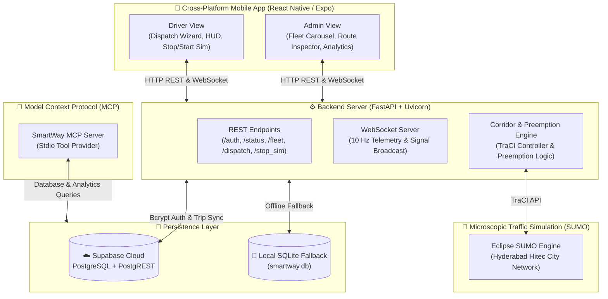

# 🚑 SmartWay: Intelligent Emergency Response & Green Wave Corridor Preemption

[](https://fastapi.tiangolo.com)
[](https://expo.dev)
[](https://eclipse.dev/sumo/)
[](https://supabase.com)
[](https://modelcontextprotocol.io)

**SmartWay** is a smart-city emergency vehicle management and traffic preemption platform designed to clear traffic bottlenecks and create synchronized "green wave" corridors for ambulances. Integrating real-time microscopic traffic simulation (Eclipse SUMO), a cross-platform mobile interface (React Native / Expo), a high-throughput backend (FastAPI), cloud database synchronization (Supabase), and AI agent orchestration (MCP Servers), SmartWay drastically reduces emergency transit times and saves lives.

---

## 📑 Table of Contents

- [Key Features](#-key-features)
  - [Role-Based Access Control](#1-role-based-access-control)
  - [Ambulance Driver Experience](#2-ambulance-driver-experience)
  - [Command Center Admin Dashboard](#3-command-center-admin-dashboard)
  - [Intelligent Green Wave Preemption](#4-intelligent-green-wave-preemption)
  - [Dynamic Traffic Bottleneck Simulation & Detour Rerouting](#5-dynamic-traffic-bottleneck-simulation--detour-rerouting)
  - [Hybrid Cloud & Zero-Downtime Offline Fallback](#6-hybrid-cloud--zero-downtime-offline-fallback)
- [System Architecture](#-system-architecture)
- [Tools & Libraries](#-tools--libraries)
  - [Mobile Application (Frontend)](#mobile-application-frontend)
  - [Simulation & API Server (Backend)](#simulation--api-server-backend)
  - [Database & Cloud Infrastructure](#database--cloud-infrastructure)
- [MCP Servers (Model Context Protocol)](#-mcp-servers-model-context-protocol)
- [Project Directory Structure](#-project-directory-structure)
- [Getting Started](#-getting-started)
  - [Prerequisites](#prerequisites)
  - [1. Backend Setup](#1-backend-setup)
  - [2. Mobile App Setup](#2-mobile-app-setup)
  - [3. Supabase Cloud Configuration](#3-supabase-cloud-configuration)
  - [Default Credentials](#default-credentials)
- [Testing & Verification](#-testing--verification)

---

## 🌟 Key Features

### 1. Role-Based Access Control
- **Driver Mode (`driver1`, `driver2`)**: Operational interface tailored for ambulance pilots with interactive dispatch controls, turn-by-turn signal preemption alerts, and dynamic trip management.
- **Admin Command Mode (`admin`)**: Strategic city-wide monitoring dashboard for emergency dispatchers. Admin access is strictly observer-oriented—simulation controls, dispatch wizards, and jam injections are hidden to prevent accidental operational interference.
- **Secure Authentication**: Salted **bcrypt password hashing** (12 rounds) stored in Supabase Cloud (`public.smartway_profiles`) with automatic local SQLite offline fallback.

### 2. Ambulance Driver Experience
- **Interactive Emergency Dispatch Wizard**:
  - **Step 1 - Emergency Incident Selection**: Select active road accident / critical incident hotspots across the Hyderabad Hitec City road network.
  - **Step 2 - Hospital Selection**: Evaluates nearby hospitals by real-time distance, ICU bed availability, and trauma level readiness.
  - **Step 3 - Instant Dispatch**: Computes optimal corridor and secondary detour routes and establishes live TraCI telemetry streaming.
- **Dynamic Start/Stop Simulation**:
  - Responsive simulation toggle button dynamically updates between `▶️ Start Simulation` (green standby mode) and `⏹️ Stop Simulation` (red active run mode) alongside `🔄 Re-Dispatch`.
  - Clean one-tap mission termination safely resets vehicle telemetry HUD and clears active corridors on both mobile and backend.
- **Turn-by-Turn Signals HUD**:
  - Real-time countdowns of upcoming traffic signals on the corridor.
  - Displays distance (meters), state (Green/Yellow/Red), and preemption status.
- **Post-Mission Debrief**:
  - Automatically pops up upon hospital arrival displaying total transit time, signals bypassed, and estimated time saved.

### 3. Command Center Admin Dashboard
- **Emergency Fleet Units Carousel**:
  - Horizontal selector listing all emergency vehicles (`AMB-108 Rapid`, `AMB-102 Trauma`) with real-time operational state badges (`[🟢 LIVE]` or `[⚪ STANDBY]`).
- **Ambulance Inspector Card**:
  - Inspects the selected ambulance in real time:
    - 📍 **Pickup Source**: Incident location and street name.
    - 🏥 **Destination Hospital**: Target emergency medical facility.
    - ⚡ **Live Speed**: Vehicle telemetry in km/h.
    - ⏱️ **Time Saved**: Cumulative seconds saved via preemption.
    - 🚦 **Signals Cleared**: Total traffic lights preempted along the trip.
- **Map Focus Controls**:
  - `🎯 Center Ambulance`: Instant smooth camera focus on the ambulance's live GPS coordinates.
  - `🗺️ Fit Full Route`: Auto-bounds camera to display the complete corridor from pickup origin to destination hospital.
- **Historical Mission Analytics**:
  - Queries Supabase `smartway_trips` to display total missions, average speed, and aggregated time saved city-wide.

### 4. Intelligent Green Wave Preemption
- Powered by TraCI (Traffic Control Interface) and SUMO (Simulation of Urban MObility).
- Scans up to 500 meters ahead of the active emergency vehicle.
- Forces approaching traffic light controllers to switch to priority green phases and holds green until the ambulance safely exits the intersection.

### 5. Dynamic Traffic Bottleneck Simulation & Detour Rerouting
- Drivers can trigger a **⚠️ Simulate Traffic Jam** event to test dynamic road obstruction scenarios.
- The backend throttles edge lane speed to simulate gridlock/roadblock conditions.
- TraCI's dynamic routing engine immediately computes an alternative detour (Alternative Route 1 / Alternative Route 2), calculates estimated time saved vs. the jam, and prompts the driver with an on-screen detour confirmation.

### 6. Hybrid Cloud & Zero-Downtime Offline Fallback
- **Supabase Cloud First**: Real-time cloud persistence for authentication (`smartway_profiles`) and trip telemetry (`smartway_trips`).
- **Local SQLite Fallback**: Automatic failover ensures uninterrupted pilot functionality and local logging even in low-connectivity or offline scenarios.

---

## 🏗️ System Architecture



---

## 🛠️ Tools & Libraries

### Mobile Application (Frontend)
| Tool / Library | Version | Description |
| :--- | :--- | :--- |
| **React Native** | `0.86.3` | Cross-platform native mobile runtime |
| **Expo** | `~57.0.20` | Universal React Native development framework and build tooling |
| **Expo Router** | `~57.0.19` | File-based typed routing engine |
| **TypeScript** | `~6.0.3` | Strongly-typed JavaScript development |
| **react-native-maps** | `^1.29.0` | Native map components with custom polylines, markers, and camera animations |
| **react-native-reanimated** | `4.5.1` | High-performance 60 FPS gesture and interface animations |
| **react-native-gesture-handler** | `~2.32.0` | Native touch and gesture recognition |
| **react-native-safe-area-context** | `~5.7.0` | Dynamic screen insets handling across modern notched devices |
| **expo-status-bar** | `~57.0.1` | Translucent dynamic status bar styling |

### Simulation & API Server (Backend)
| Tool / Library | Version | Description |
| :--- | :--- | :--- |
| **Python** | `3.10+` | Core server language |
| **FastAPI** | `Latest` | High-performance asynchronous web framework |
| **Uvicorn** | `Latest` | Lightning-fast ASGI web server |
| **Eclipse SUMO** | `1.22+` | Microscopic urban mobility and traffic simulation suite |
| **TraCI (traci)** | `Latest` | Python Traffic Control Interface for real-time SUMO vehicle/signal manipulation |
| **bcrypt** | `Latest` | Industry-standard salted password hashing (`rounds=12`) |
| **requests** / **httpx** | `Latest` | Asynchronous HTTP clients for Supabase PostgREST communication |
| **sqlite3** | Built-in | Zero-dependency local relational cache and offline fallback |
| **asyncio** | Built-in | Asynchronous event loop powering the 10Hz telemetry broadcast |

### Database & Cloud Infrastructure
| Tool / Service | Description |
| :--- | :--- |
| **Supabase PostgreSQL** | Managed cloud relational database with Row Level Security (RLS) |
| **Supabase PostgREST** | Instant RESTful API for querying profiles and persisting mission logs |
| **OpenStreetMap (OSM)** | Source map geometry for Hyderabad Hitec City corridor network |

---

## 🤖 MCP Servers (Model Context Protocol)

SmartWay exposes a built-in **Model Context Protocol (MCP)** server (`backend/mcp_server.py`) using standard `stdio` transport. This allows AI assistants and external agentic workflows to inspect traffic conditions, recommend hospitals, report road bottlenecks, and extract fleet intelligence.

### Exposed MCP Tools

1. **`query_traffic_data(sql_query: str)`**
   - Safely executes read-only `SELECT` queries on the traffic database to query active incidents, available hospitals, completed missions, or reported congestions.
2. **`report_road_congestion(road_name: str, edge: str, slowdown_pct: int = 75)`**
   - Logs a live traffic congestion or roadblock event on a specified network edge in Hyderabad, triggering dynamic rerouting.
3. **`get_best_hospital_for_patient(severity: str = "High")`**
   - Evaluates all hospitals in the network and ranks them based on real-time ICU bed availability, trauma facility tier, and proximity.
4. **`get_mission_analytics()`**
   - Calculates aggregate mission metrics: total runs completed, traffic lights preempted, cumulative seconds saved, and average corridor distance.
5. **`get_fleet_analytics()`**
   - Fetches live fleet operations and recent emergency trip summaries directly from the Supabase cloud database.

---

## 📁 Project Directory Structure

```text
SmartWay/
├── SmartWayApp/                         # Cross-Platform React Native (Expo) App
│   ├── assets/                          # App icons, splash screens, and images
│   ├── src/
│   │   └── app/
│   │       ├── index.tsx                # Main Screen (Driver HUD & Admin Command Center)
│   │       ├── _layout.tsx              # Root Stack Navigation Layout
│   │       └── +not-found.tsx           # 404 Fallback Route
│   ├── app.json                         # Expo configuration
│   ├── package.json                     # Node.js dependencies & scripts
│   └── tsconfig.json                    # TypeScript compiler options
├── backend/                             # Python Backend & Simulation Server
│   ├── database.py                      # SQLite local database initialization & seed data
│   ├── main.py                          # FastAPI application, WebSocket & SUMO TraCI loop
│   ├── mcp_server.py                    # Model Context Protocol (MCP) tool provider
│   ├── supabase_client.py               # Supabase Cloud client with bcrypt auth & sync
│   └── smartway.db                      # Local fallback SQLite database (runtime generated)
├── sumo_model/                          # SUMO Traffic Simulation Assets
│   ├── hyderabad.net.xml                # Compiled road network (Hyderabad Hitec City)
│   ├── hyderabad.osm                    # Raw OpenStreetMap XML data
│   └── trips.trips.xml                  # Background traffic trip definitions
├── frontend/                            # Legacy web viewer prototype
│   └── index.html                       # Standalone Leaflet-based simulation viewer
├── supabase_schema.sql                  # Supabase initial database schema & tables
├── supabase_migration_password_hash.sql # SQL migration for bcrypt password hashing
├── .gitignore                           # Git exclusion rules
└── README.md                            # Project documentation (this file)
```

---

## 🚀 Getting Started

### Prerequisites
- **Node.js** (v18 or higher) and **npm**
- **Python** (v3.10 or higher)
- **Eclipse SUMO** installed and added to `PATH` (or default install directory)
- **Expo Go** app installed on your physical mobile device (iOS/Android), or an active simulator.

---

### 1. Backend Setup

1. Open a terminal in the `backend/` directory:
   ```bash
   cd backend
   ```
2. Install the required Python packages:
   ```bash
   pip install fastapi uvicorn traci sumolib bcrypt requests httpx mcp
   ```
3. *(Optional)* Configure environment variables for custom Supabase credentials:
   ```bash
   # Windows PowerShell
   $env:SUPABASE_URL="https://your-project.supabase.co"
   $env:SUPABASE_KEY="your-anon-or-service-key"
   ```
4. Start the FastAPI server:
   ```bash
   python -m uvicorn main:app --host 0.0.0.0 --port 8000
   ```
   The backend will start on `http://0.0.0.0:8000`. WebSocket endpoint is available at `ws://localhost:8000/ws`.

---

### 2. Mobile App Setup

1. Open a terminal in the `SmartWayApp/` directory:
   ```bash
   cd SmartWayApp
   ```
2. Install npm dependencies:
   ```bash
   npm install
   ```
3. Start the Expo development server:
   ```bash
   npx expo start
   ```
4. Scan the QR code using the **Expo Go** app on your mobile device (ensure your mobile device is on the same local Wi-Fi network as the backend server).

---

### 3. Supabase Cloud Configuration

If setting up a fresh Supabase project:
1. Navigate to your Supabase Project **SQL Editor**.
2. Run the script provided in [`supabase_schema.sql`](supabase_schema.sql).
3. Verify that `public.smartway_profiles` and `public.smartway_trips` are created with active Row Level Security (RLS) policies.

---

### 🔑 Default Credentials

Use the convenient pre-fill chips on the login modal or enter the credentials below:

| Role | Username | Password | Notes |
| :--- | :--- | :--- | :--- |
| **Driver 1** | `driver1` | `123` | Assigned to `AMB-108 Rapid Response` |
| **Driver 2** | `driver2` | `123` | Assigned to `AMB-102 Trauma Unit` |
| **Administrator** | `admin` | `admin` | HQ Command Center Fleet Observer |

---

## 🧪 Testing & Verification

1. **Verify Type Safety**:
   ```bash
   cd SmartWayApp
   npx tsc --noEmit
   ```
2. **Test Endpoints**:
   - Check status: `curl http://localhost:8000/status`
   - Active fleet: `curl http://localhost:8000/fleet`
   - Incidents: `curl http://localhost:8000/incidents`
   - Hospitals: `curl http://localhost:8000/hospitals`
3. **Run MCP Server via Stdio**:
   ```bash
   python backend/mcp_server.py
   ```

---

## 📄 License

This project is licensed under the MIT License.
